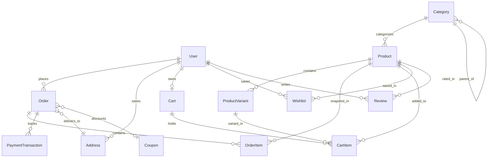

# Stitch & Crafts — Database Architecture & Entity Design

Database Engine: PostgreSQL 16+ / 18
ORM: Prisma ORM

## Entity Relational Architecture

## Tables & Schemas

### 1. User
- `id`: UUID PK
- `name`: String
- `email`: String (Unique, Indexed)
- `password`: String (bcrypt hash)
- `role`: Enum (`CUSTOMER`, `ADMIN`, `SUPER_ADMIN`)
- `refreshTokenHash`: String (nullable, SHA-256)

### 2. Product & ProductVariant
- `Product`: `id`, `title`, `slug` (Unique), `description`, `details` (JSON specs), `price` (Decimal), `discountPrice` (Decimal), `stock` (Int), `sku` (Unique), `images` (String[]), `categoryId`, `featured` (Boolean), `isPublished` (Boolean).
- `ProductVariant`: `id`, `productId` (Cascade), `colorName`, `colorHex`, `size`, `sku` (Unique), `priceDelta` (Decimal), `stock` (Int), `images` (String[]).

### 3. Cart & CartItem
- `Cart`: `id`, `userId` (Unique, Cascade).
- `CartItem`: `id`, `cartId` (Cascade), `productId` (Cascade), `variantId` (SetNull), `quantity` (Int), Unique constraint `@@unique([cartId, productId, variantId])`.

### 4. Order & OrderItem
- `Order`: `id`, `userId`, `shippingAddressId`, `subtotal`, `discountAmount`, `shippingFee`, `taxAmount`, `totalAmount`, `paymentStatus`, `orderStatus`, `paymentProvider`, `trackingNumber`, `trackingCarrier`.
- `OrderItem`: `id`, `orderId` (Cascade), `productId` (Restrict), `variantId` (SetNull), `quantity`, `price` (Purchased snapshot), `totalPrice` (Snapshot).

### 5. PaymentTransaction
- `id`, `orderId` (Cascade), `provider`, `transactionId` (Unique), `amount`, `currency`, `status`, `rawResponse` (JSON).

### 6. Coupon, Review, Banner, Newsletter
- `Coupon`: `code` (Unique), `discountType`, `discount`, `minOrderValue`, `maxDiscount`, `usageLimit`, `usageCount`, `expiryDate`, `isActive`.
- `Review`: `userId`, `productId`, `rating` (1-5), `title`, `comment`, `isVerified`, `isApproved`, `@@unique([userId, productId])`.
- `Banner`: `title`, `subtitle`, `imageUrl`, `targetUrl`, `displayOrder`, `isActive`.
- `NewsletterSubscription`: `email` (Unique), `isActive`.
